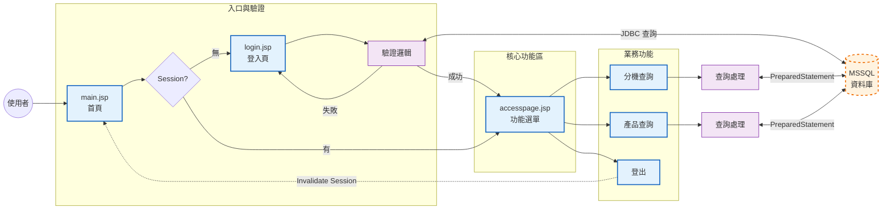

# 資料庫查詢與稽核應用系統

## 專案簡介 (Project Introduction)
這是一個基於**Java Web** 技術 (**JSP** + **Servlet**) 建構的**內部作業模擬系統**。專案核心目的是模擬企業後端開發實務，實踐**安全登入稽核**、**員工資訊查詢**及**產品資料查詢**等功能。系統採用經典的 **Tomcat 伺服器**搭配 **JDBC 驅動**，實現與 **Microsoft SQL Server (MSSQL)** 的高效、穩定的資料串接。

本專案著重於展示：
- **後端邏輯層 (Servlet)** 與 **前端呈現層 (JSP)** 的職責分離。
- **資料庫連線池**的概念實踐（雖然目前為簡單 JDBC，但強調概念）。
- 對**資料存取權限**與**使用者身分驗證**的基礎安全思考。

## 核心功能 (Key Features)
1. **安全登入與稽核**： 驗證使用者身分，確保系統存取權限。
2. **成員分機查詢**： 根據員工姓名或部門等條件，查詢員工聯繫資訊。
3. **產品資訊查詢**： 查詢產品細節與狀態。

## 技術堆疊 (Tech Stack)
| 類別 | 技術名稱 | 說明 |
| :-- | :-- | :-- |
| 後端核心 | Java (JSP, Servlet) | 實現業務邏輯與控制器。
| 資料庫 | Microsoft SQL Server (MSSQL) | 採用業界常用資料庫，基於 Northwind 擴充。
| 資料存取 | Microsoft JDBC Driver 12.8.1 | Java 連結 MSSQL 的標準驅動。
| Web 伺服器 | Apache Tomcat 10.1 | 作為 Web Container 運行 JSP/Servlet 應用。
| 開發環境 | Visual Studio Code | 搭配 Extension Pack for Java, Community Server Connectors。

## 核心系統流程與功能展示 (Core System Flow & Features)

1. **系統流程圖**(System Flowchart)


2. **程式碼精華與安全實踐** (Code Highlights & Security)
- 登入稽核與會話 (Session) 建立：
     ```login.jsp``` 負責接收使用者帳號密碼，透過 JDBC 查詢 dbo.member 資料表進行驗證。驗證成功後，立即建立 HttpSession，設定存取權杖 (access="y") 和 5 分鐘的會話過期時間，確保使用者在超時後必須重新登入。
     
     
     
- 專案**未使用傳統字串串接來組合 SQL 語句**，而是採用 **PreparedStatement**。如下圖所示，透過 LIKE ? 佔位符和 pstmt.setString() 綁定參數，能有效防範 SQL 注入 (SQL Injection) 攻擊。
     
     

## 環境建置與執行指南 (Setup & Execution Guide)
本專案需配置 Java 開發環境、MSSQL 資料庫，以及 Tomcat Web 伺服器。

**步驟一：資料庫配置 (MSSQL Setup)**
1. **建立與匯入資料庫**：
  - 開啟 SSMS (SQL Server Management Studio)，建立名為 **NorthWind** 的新資料庫。
  - 對專案提供的 ```Northwind.sql``` 腳本執行「**新增查詢**」，以建立所有必要的資料表結構。
2. **設定 SQL Server 驗證** (sa 帳戶)：
  - 確保 MSSQL 伺服器**屬性 > 安全性**中，已勾選「**SQL Server 及 Windows 驗證模式**」。
  - 在 **安全性 > 狀態** 中，**啟用** sa 帳戶，並設定密碼 (預設範例：1234)。

     *重要： 修改後，務必透過服務管理員重新啟動 SQL Server (MSSQLSERVER) 服務。*

3. **啟用 TCP/IP 連線**：
  - 開啟 SQLServerManager。
  - 至 SQL Server 網路組態 > MSSQLSERVER 的通訊協定，**啟用 TCP/IP**。
  - 確認 IP 位址下的 TCP 連接埠固定為 **1433**，這是 Java 應用連線的預設埠。

**步驟二：Web 伺服器與專案設定 (Tomcat & Project Setup)**
1. **Tomcat 伺服器配置**：
  - 下載並安裝 **Apache Tomcat 10.1** (官方連結： https://tomcat.apache.org/download-10.cgi )。
  - 確認 conf/server.xml 中 Resource name="UserDatabase" 設定正確。
    (C:\Program Files\Apache Software Foundation\Tomcat 10.1)

2. **配置 JDBC Driver**：
  - 下載 Microsoft JDBC Driver for SQL Server (12.8.1)。(官方連結: https://learn.microsoft.com/zh-tw/sql/connect/jdbc/release-notes-for-the-jdbc-driver?view=sql-server-ver16 )。或是直接使用專案提供的檔案。
  - 將 ``` mssql-jdbc-12.8.1.jre8.jar ```、``` mssql-jdbc-12.8.1.jre11.jar ``` 檔案複製到 **Tomcat** 安裝路徑下的 ```lib``` 資料夾中
    (```C:\Program Files\Apache Software Foundation\Tomcat 10.1\lib```)。
 
3. **VS Code 開發環境配置**：
  - 安裝必要的 VS Code 擴充套件：**Extension Pack for Java**、**Database Client JDBC** 和 **Community Server Connectors**。
  - 在檔案總管**建立新 Java 專案**，並命名為 ```MyJspProject```，將專案附帶的 ```SQLDatabaseConnection.java ```取代原專案的src/App.java。
  - 在 "**SERVERS**" 面板中，新增 **Tomcat Server**，指向本機安裝路徑：點擊右上角Creat New Serve圖示 > No, use server on disk > 選擇Tomcat 10.1(C:\Program Files\Apache Software Foundation) > finish
  - 在 "**JAVA PROJECTS**" 面板中，將 JDBC Jar 檔（``` mssql-jdbc-12.8.1.jre8.jar ```、``` mssql-jdbc-12.8.1.jre11.jar ```）加入專案的 **Reference Libraries**，以確保專案編譯與執行通過。

**步驟二：檔案部署與執行**
  - 將專案資料夾 ```MyJspProject``` 複製到 Tomcat 10.1 的 **webapps** 資料夾中。
  - 在 SQL Serve 驗證下登入情況下，於 VS code 執行 ```MyJavaProject``` 專案的```src/Main.java```，且終端機顯示「**連結成功**」。
  - 在 VS Code 的 "**SERVERS**" 面板中，對 Tomcat Server 點擊 "**Start Server**" 啟動伺服器。
  - 開啟瀏覽器，輸入：```localhost:8080/MyJspProject/main.jsp``` 即可存取。

## 連結 (Links)
[ GitHub Repository ] (https://github.com/shao7777777/CTBC_Java_DB_Query_Audit.git)
